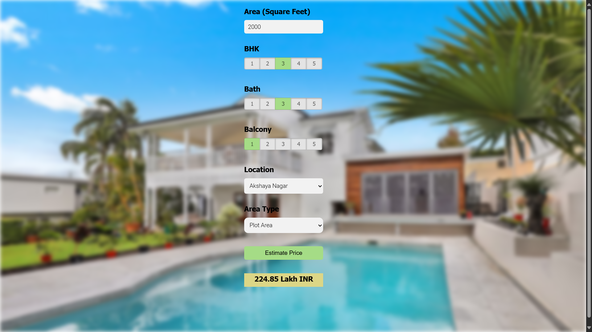

# Bengaluru House Price Prediction

This project is a web-based application designed to predict house prices in Bengaluru using machine learning. It uses **FastAPI** for the backend and **JQuery** to handle client-server requests. The prediction model is trained using a dataset of Bengaluru real estate prices, and the application can be accessed via a deployed version.

## Table of Contents
- [Project Overview](#project-overview)
- [Architecture](#architecture)
- [Model Training](#model-training)
- [Deployment](#deployment)
- [Installation Guide](#installation-guide)
- [Usage](#usage)
- [Screenshots](#screenshots)
- [Technologies Used](#technologies-used)
- [Contributing](#contributing)
- [License](#license)

## Project Overview
The Bengaluru House Price Prediction app helps users estimate property prices in the Bengaluru region based on features like the number of bedrooms, size in square feet, location, etc. The app uses a machine learning model trained on historical house price data to make these predictions.

### Key Features:
- Interactive web-based UI for entering property details
- Instant house price predictions
- Built with **FastAPI** for backend APIs and **JQuery** for dynamic client-server interactions
- Deployed and accessible online

## Architecture

The project follows a modular architecture, with a clear separation between the client and server logic.

### 1. **Client**:
- This folder contains the **HTML**, **CSS**, and **JavaScript** files.
- **JQuery** is used to send user inputs to the backend server and display results dynamically without needing to reload the page.

### 2. **Server**:
- This folder contains the **FastAPI** server code.
- The server receives client requests (like house features), passes them through the trained model, and returns the predicted price to the client.
- The core logic for interacting with the prediction model resides here.

### 3. **Model**:
- This folder contains the trained machine learning model and the **Jupyter notebook** (`.ipynb`) used for training the model.
- The model was trained using historical real estate data from Bengaluru, covering various features such as location, number of bedrooms, square footage, etc.
  
### 4. **Requirements**:
- The **requirements.txt** file lists all the dependencies for running the application, including FastAPI and other necessary libraries for prediction.

## Model Training

The model training process is captured in the **model folder** under the Jupyter Notebook (`.ipynb`). The process involves:
- Data preprocessing (cleaning, feature engineering, etc.)
- Splitting the dataset into training and testing sets
- Training a regression model (such as **Linear Regression**, **Decision Tree**, or **Random Forest**)
- Model evaluation and tuning for better accuracy

The trained model is saved and loaded by the server to provide real-time predictions.

## Deployment

The project is deployed on **Railway**, a platform for hosting web applications. You can access the deployed version of the app through the following link:

### [Bengaluru House Price Prediction App](https://bangulur-house-price-prediction.up.railway.app/)

For deployment, a separate branch of this repository was created, which includes deployment-specific changes:
- Branch: [railway-deploy](https://github.com/chirag-agrawal24/Bangulur-house-price-prediction/tree/railway-deploy)

## Installation Guide

To run the project locally, follow the steps below:

1. **Clone the repository**:
    ```bash
    git clone https://github.com/chirag-agrawal24/Bangulur-house-price-prediction.git
    cd Bangulur-house-price-prediction
    ```

2. **Set up a virtual environment** (optional but recommended):
    ```bash
    python3 -m venv venv
    source venv/bin/activate   # On Windows, use `venv\Scripts\activate`
    ```

3. **Install the dependencies**:
    ```bash
    pip install -r requirements.txt
    ```

4. **Start the FastAPI server**:
    ```bash
    cd server
    uvicorn server:app --reload
    ```

5. **Access the app**:
    Open the html file in your browser

## Usage

Once the app is running, enter the property details into the input form provided (such as the number of bedrooms, size in square feet, location, etc.) and click **Submit**. The predicted price will be displayed on the same page.

## Screenshots

Here’s a preview of the web app interface:



## Technologies Used

- **Backend**: FastAPI
- **Frontend**: HTML, CSS, JavaScript, JQuery
- **Machine Learning**: Scikit-learn
- **Deployment**: Railway
- **Version Control**: Git

## Contributing

Contributions are welcome! If you'd like to contribute, please follow these steps:
1. Fork the repository
2. Create a new branch for your feature or bugfix (`git checkout -b feature-name`)
3. Commit your changes (`git commit -m 'Add feature'`)
4. Push to the branch (`git push origin feature-name`)
5. Open a Pull Request

## License

This project is licensed under the MIT License - see the [LICENSE](LICENSE) file for details.


